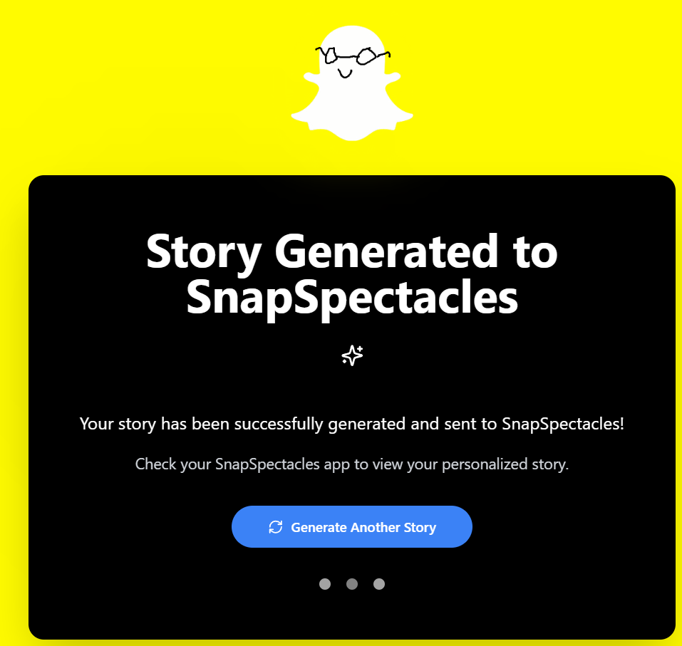

# 🌌 SpectraSphere

🏆 **Winner of the Snap Inc. API Prize at Hack the North 2025** 🏆  

Built with ❤️ by:  
- [Allen Ng](https://www.linkedin.com/in/allenngkc/)  
- [Raed Rahman](https://www.linkedin.com/in/raed-rahman-a59073203/)  
- [Anindya Barua](https://www.linkedin.com/in/abarua99/)  
- [Tyseer Toufiq](https://www.linkedin.com/in/tyseertoufiq/)  

---

**SpectraSphere** is a hackathon project built at Hack the North 2025. It transforms a handful of photos and a short trip description into a **five-panel, themed storyboard**. Each story feels like a mini comic flipbook, complete with captions and stylized visuals. You can view and share the generated story as an immersive AR experience.  

SpectraSphere also integrates with **Snap Spectacles**:  
- Open your generated story inside the glasses to view your panels in immersive AR.  
- The glasses will **read the captions aloud** so the experience feels narrated.  
- Alongside your story, the system generates a **3D interactive object** that symbolizes the trip (e.g. a ramen bowl for a food adventure, a torii gate for a Japan trip).  
- This object floats in AR, and you can walk around it, tap it, or interact with it as a living memory anchor.  

---

## 🎥 Demo

<p align="center">
  
  <br>
  
  
</p>

---

## ⚙️ Setup (Spectacles App)

This repo ships a single runnable app for demos: **`spectacles/`**.  
No separate backend/frontend needed.  

### 1. Clone the repo
```bash
git clone https://github.com/your-username/spectrasphere.git
cd spectrasphere/spectacles
```

### 2. Install dependencies
```bash
npm install
```

### 3. Configure environment variables
Create a `.env` file in `spectacles/` (or use Lenstudio Project Settings) with:

```env
# Public JSON endpoint with your generated story
VITE_STORY_URL=https://api.jsonbin.io/v3/b/<JSONBIN_ID>/latest?meta=false
```

### 4. Run the app
```bash
npm run dev
```

Now open the preview URL (or `http://localhost:3000`) and load the app into Snap Spectacles.

---

## 💻 Run in Lenstudio

1. Go to [Lenstudio](https://lenstudio.dev) and **import this repo**  
   - *New Project* → *Import from GitHub* → paste the repo URL  

2. Open a terminal in Lenstudio and run:
```bash
cd spectacles
npm install
npm run dev
```

3. In **Project Settings → Environment**, add:
```env
VITE_STORY_URL=https://api.jsonbin.io/v3/b/<JSONBIN_ID>/latest?meta=false
```

4. Use the **public preview URL** that Lenstudio provides for `spectacles/`.  

---

## 🚀 Usage

1. **Upload 4 photos** of your trip.  
2. **Enter a short trip blurb** (e.g. “A weekend at Hack the North coding and exploring Waterloo”).  
3. Our backend (Cohere + Jsonbin) generates a 5-panel story JSON.  
4. That JSON is hosted at a **stable public URL**.  
5. The **Spectacles app** fetches this JSON and renders it as a flipbook in your chosen theme.  
6. Open in **Snap Spectacles** for a narrated AR flipbook + floating 3D memory object.  

---

## 🛠️ Tech Stack

- **Frontend:** React + Tailwind (flipbook + themes)  
- **App Folder:** `spectacles/` (standalone viewer)  
- **AI Model:** Cohere Aya Vision (`c4ai-aya-vision-32b`)  
- **Storage:** Jsonbin (public JSON endpoint)  
- **Other Tools:** Lucide icons, styled components  
- **Hardware Integration:** Snap Spectacles (AR narration + 3D object generation)  

---

## 📸 Example Themes

- Comic Book  
- Studio Ghibli  
- Watercolor Travel Journal  
- Cyberpunk Neon  

---

## 🔗 Learn More

- 🚀 [Devpost](https://devpost.com/tyseer2334)  
- 💻 [GitHub](https://github.com/tyseer2335/SpectraSphere)  
- 🐦 [Twitter](https://twitter.com/tyseer2334)  
